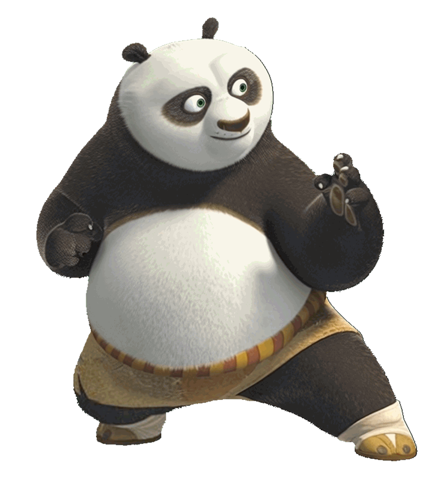

# Po (Kung Fu Panda)

---

## Información

- **Personaje:** Po  
- **Origen:** Película *Kung Fu Panda* (DreamWorks)  
- **Autor del proyecto:** Mugen's World  
- **Estado:** En desarrollo (etapa muy temprana)

---

## Descripción

Este proyecto busca recrear a **Po**, el Guerrero Dragón de la saga *Kung Fu Panda*, como un personaje jugable para **MUGEN**.

Actualmente el proyecto se encuentra en una **fase muy temprana de desarrollo**, enfocándose principalmente en la creación de los **sprites base del personaje**, comenzando con la animación de **stand**.

Con el tiempo se irán agregando más animaciones, movimientos y habilidades inspiradas en las técnicas de kung fu del personaje.

---

## Desarrollo

Los sprites del personaje están siendo **creados desde cero** utilizando herramientas de IA y procesos de animación.

El proceso general incluye:

1. Creación de sprites base
2. Generación de animaciones
3. Conversión de animaciones a frames
4. Conversión final a sprites BMP compatibles con MUGEN

Herramientas utilizadas durante el proceso:

- ChatGPT
- Grok
- Gemini
- A2E
- Vidu
- Herramientas de extracción de frames

---

## Créditos

**Autor del proyecto**

- Mugen's World

---

## Estado del proyecto

🚧 Proyecto en desarrollo temprano

Actualmente el personaje se encuentra en una **fase muy inicial**, incluyendo:

- Creación de sprites
- Animación base (stand)
- Desarrollo de movimientos
- Implementación de mecánicas de combate

---

## Filosofía del proyecto

Este proyecto sigue el espíritu de la comunidad **MUGEN**:

> MUGEN es de la comunidad para la comunidad.

---

## Uso y distribución

Este proyecto es completamente libre para la comunidad.

Se permite:

- Usar el personaje
- Modificarlo
- Crear versiones derivadas
- Usar los sprites
- Integrarlo en otros proyectos

No existen restricciones de uso.

Bajo ninguna circunstancia este contenido debe venderse.

---

## Futuro del proyecto

Planes a futuro para el personaje:

- Animaciones completas
- Movimientos inspirados en las técnicas de kung fu de Po
- Ataques especiales y combos
- Posible implementación del **Wuxi Finger Hold**
